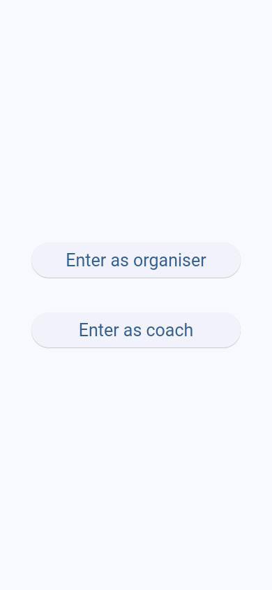
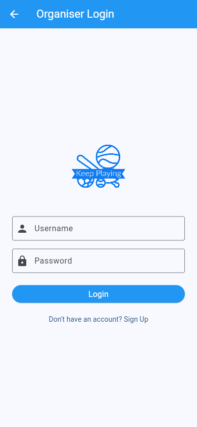
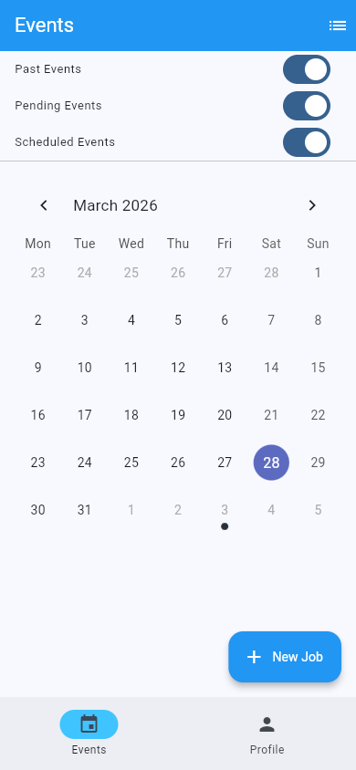
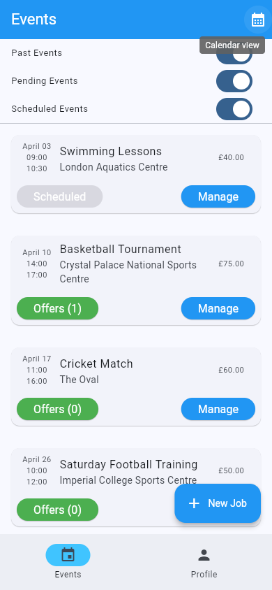
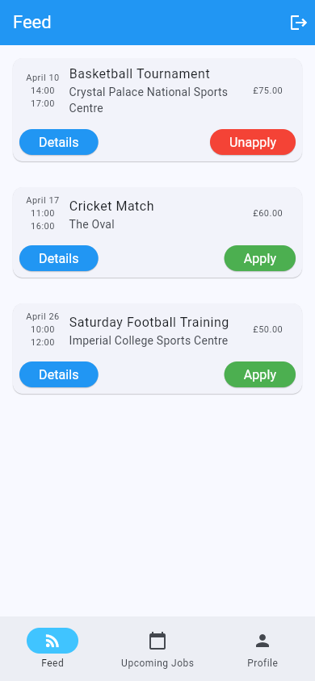

# Keep Playing

A sports coaching platform that connects event organisers with coaches and referees.

## 📸 Screenshots

| Landing                                     | Login                                   | Organiser (Calendar)                                    | Organiser (Events)                                  | Coach (Feed)                                      |
| ------------------------------------------- | --------------------------------------- | ------------------------------------------------------- | --------------------------------------------------- | ------------------------------------------------- |
|  |  |  |  |  |

## ✨ Features

### General

- **Two-role system** — separate sign-up and login flows for organisers and coaches
- **Email notifications** — coaches are notified when accepted for an event
- **Demo data seeding** — pre-populated accounts and events for quick evaluation

### For Organisers

- **Create and manage events** — set sport, role, date, time, location, and price
- **Calendar view** — see all your events at a glance, drill into individual days
- **Accept coach offers** — review applicants and choose the best fit
- **Rate coaches** — score reliability, flexibility, and experience after each event
- **Favourites and block lists** — save coaches you trust, block ones you don't
- **Default settings** — pre-fill new events with your preferred sport, role, location, and price

### For Coaches

- **Browse available events** — feed of open events filtered by your sport and role
- **Apply and withdraw** — express interest in events or change your mind
- **Upcoming jobs** — see all your confirmed assignments in one place
- **Profile with qualifications** — showcase your experience and certifications


## 🚀 Getting Started

### Prerequisites

- [Docker](https://docs.docker.com/get-docker/) and Docker Compose

### Start the app

```bash
docker-compose up --build
```

First build takes a few minutes (Flutter SDK download + compilation). Subsequent starts are much faster.

Open **http://localhost** in your browser. The app renders inside a phone-frame wrapper.

### Demo accounts

| Role      | Username         | Password   |
| --------- | ---------------- | ---------- |
| Organiser | `organiser_demo` | `demo1234` |
| Coach     | `coach_demo`     | `demo1234` |
| Coach 2   | `coach_demo2`    | `demo1234` |

Demo data is seeded automatically on first start.

### Stop the app

```bash
docker-compose down        # Stop containers (data persists)
docker-compose down -v     # Stop and delete all data (clean reset)
```

## 🛠 Tech Stack

| Layer          | Technology                                       |
| -------------- | ------------------------------------------------ |
| Backend        | Django 5.2, Django REST Framework, PostgreSQL 14 |
| Frontend       | Flutter 3.41 (web), BLoC/Cubit state management  |
| Infrastructure | Docker Compose, nginx reverse proxy, gunicorn    |

See [backend/README.md](backend/README.md) and [frontend/README.md](frontend/README.md) for component-specific documentation.
