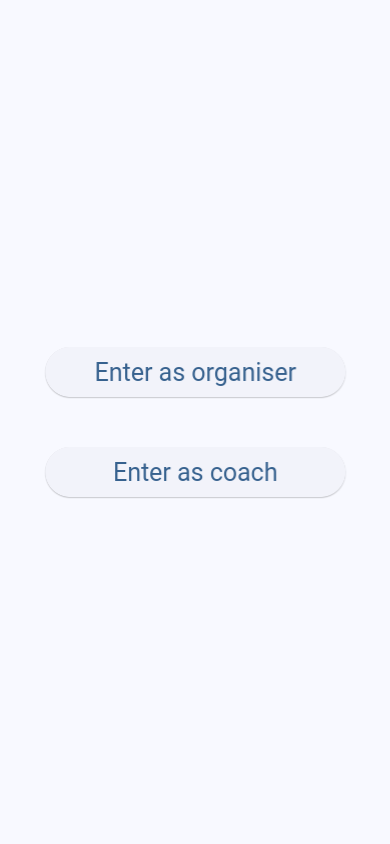
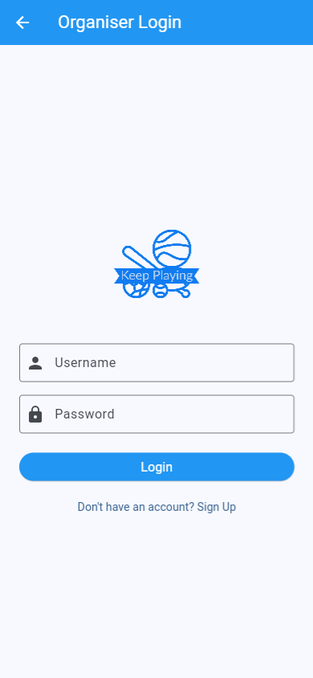
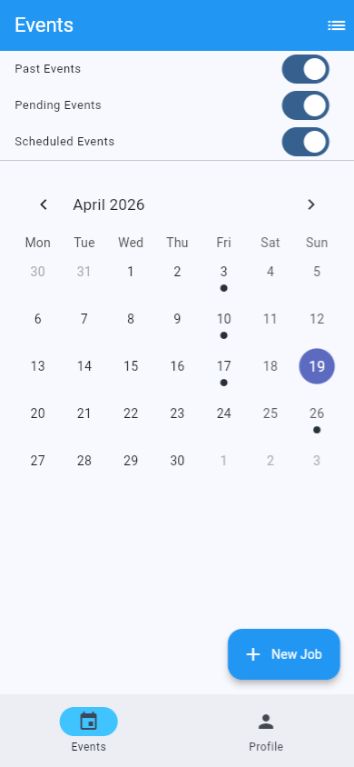
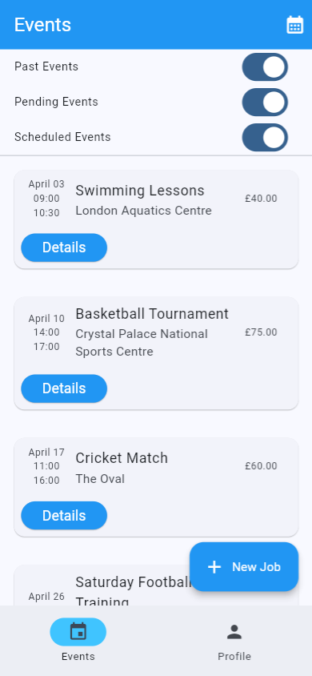
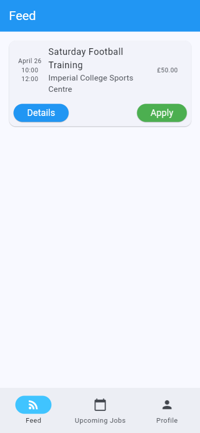

# Screenshots

A visual tour of the running app.

## 📋 Overview

The current UI is captured as static PNGs at `docs/screenshots/`. The web app renders inside a phone-frame wrapper, so the screenshots reflect that framing.

## 🖼️ Current UI

### Landing

The unauthenticated entry point. Two pill-shaped role buttons route to the organiser login flow or the coach login flow. Logged-in users hitting the landing page are auto-redirected to their role's home page; users who hold both roles get a chooser dialog before navigation.

### Login

Username and password form fronted by the Keep Playing logo, with a `Sign Up` link below the login button. The app bar title (`Organiser Login` here, or `Coach Login` for the coach entry) marks which role variant is active — the same form serves both, distinguished only by which role's account it authenticates.

### Organiser (Calendar)

The organiser's events screen in **calendar mode** — a calendar with event dots on days that have something scheduled, and a highlighted selected day. Three toggles at the top filter past / pending / scheduled events; a `+ New Job` floating button opens the event creator; the bottom tab bar switches between `Events` and `Profile`. The icon in the top-right of the app bar toggles to the [list view](docs/screenshots/04-organiser-events.png).

### Organiser (Events)

The same Events screen in **list mode** — every event surfaced as a card with date, time, name, location, and price, plus a `Details` button to drill in. The same past / pending / scheduled toggles and `+ New Job` floating button apply; the calendar icon in the top-right toggles back to [calendar view](docs/screenshots/03-organiser-calendar.png).

### Coach (Feed)

The coach's open-event feed, filtered by sport and role. Each card shows date, time, name, location, and price, with `Details` to drill in and `Apply` to express interest in the role. The bottom tab bar switches between `Feed` (here), `Upcoming Jobs` (confirmed assignments), and `Profile`.

## 📂 Sub-Module Documentation

- [`README.md`](README.md) — root README with quick start, demo accounts, and configuration.
- [`README.tech-stack.md`](README.tech-stack.md) — primer on every library and framework in the stack.
