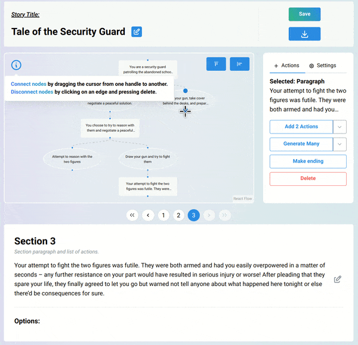
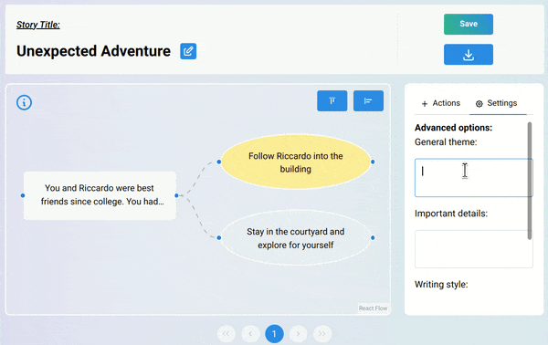

# Choose Your Own Adventure - AI Gamebook Generator

An AI-powered interactive gamebook generator that creates branching narrative stories using OpenAI's language models. Built as a group project at Imperial College London.

Users provide a theme and attributes, and the system generates a complete choose-your-own-adventure story with multiple branching paths. Stories can be explored, edited, and exported through a visual graph editor.


## Quick Start

**Prerequisites:** [Docker](https://docs.docker.com/get-docker/) and an [OpenAI API key](https://platform.openai.com/api-keys).

```bash
git clone https://github.com/<your-username>/choose-your-own-adventure.git
cd choose-your-own-adventure

cp .env.example .env
# Edit .env and add your OpenAI API key

docker compose up --build
```

Open [http://localhost:3000](http://localhost:3000).

A demo account is pre-seeded: `demo@example.com` / `password` with two sample stories.

## Features

- **AI Story Generation** - Generate branching narratives from a theme and attributes (genre, characters, items)
- **Interactive Graph Editor** - Visualize and navigate the story tree using an interactive flow diagram
- **Node-by-Node Expansion** - Generate new story branches, actions, and endings individually
- **Bulk Generation** - Auto-expand entire story subtrees to a specified depth
- **Story Management** - Save, load, rename, and delete stories from a personal dashboard
- **Export** - Download stories as DOCX or TXT files
- **Duplicate Detection** - Uses sentence-transformers to detect semantically similar story branches



## Architecture

```
Browser (localhost:3000)
    |
    +-- Static files (React SPA)
    |       served by Nginx
    |
    +-- /api/* -----> Nginx reverse proxy -----> Backend (Tornado :8000)
    |                                                |
    +-- /ws --------> Nginx WS proxy ----------> WebSocket handler
                                                     |
                                              +------+------+
                                              |             |
                                          MongoDB       OpenAI API
                                       (persistence)   (generation)
```

All traffic goes through a single Nginx entry point. The backend is not exposed directly — Nginx proxies REST API calls (`/api/`) and WebSocket connections (`/ws`) to the Tornado server internally.

## Tech Stack

| Layer | Technologies |
|-------|-------------|
| **Frontend** | React 18, TypeScript, Vite, Redux Toolkit, ReactFlow, Mantine UI, Tailwind CSS |
| **Backend** | Python 3.10, Tornado (async WebSocket server), Motor (async MongoDB driver) |
| **AI/ML** | OpenAI Responses API (gpt-4.1), Sentence-Transformers + PyTorch (duplicate detection) |
| **Infrastructure** | Docker Compose, Nginx (reverse proxy), MongoDB 6 |

## Project Structure

```
.
├── docker-compose.yml
├── .env.example
├── frontend/
│   ├── Dockerfile
│   ├── nginx.conf
│   ├── src/
│   │   ├── api/            # API and WebSocket client
│   │   ├── components/     # React components
│   │   ├── pages/          # Route pages
│   │   ├── store/          # Redux state management
│   │   └── utils/          # Graph utilities, file export
│   └── public/
├── backend/
│   ├── Dockerfile
│   ├── src/
│   │   ├── models/         # OpenAI API integration
│   │   ├── server/         # Tornado HTTP + WebSocket handlers
│   │   ├── graph.py        # Gamebook graph data structure
│   │   ├── gamebook_generator.py  # Story generation orchestration
│   │   ├── text_generator.py      # Prompt engineering
│   │   └── analyser.py     # Duplicate detection
│   ├── tests/
│   └── mongo-init/         # Database seed data
└── README.md
```



## Configuration

| Variable | Required | Default | Description |
|----------|----------|---------|-------------|
| `OPENAI_API_KEY` | Yes | — | Your OpenAI API key |
| `OPENAI_MODEL` | No | `gpt-4.1` | OpenAI model to use |
| `COOKIE_SECRET` | No | (default) | Secret for session cookies |

## Known Limitations

- Passwords are stored in plaintext (this was a university project focused on AI/NLP, not production security)
- The backend Docker image is large (~2-3 GB) due to PyTorch and sentence-transformers dependencies
- First build takes several minutes to download ML model weights
