# Screenshots

A visual tour of the running app, plus an archive of GIFs from an earlier version of the UI.

## 📋 Overview

The current UI is captured as static PNGs at `docs/screenshots/`. The four GIFs in `docs/screenshots/legacy/` were captured against an earlier build — the flows still illustrate the major paths through the app, but the visuals have evolved.

## 🖼️ Current UI

### Welcome

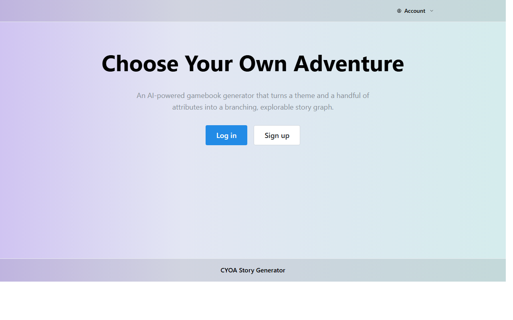

The unauthenticated landing page. Hero copy plus two routing call-to-action buttons (`Log in` and `Sign up`). Logged-in visitors hitting this URL are sent straight to their dashboard.

### Login

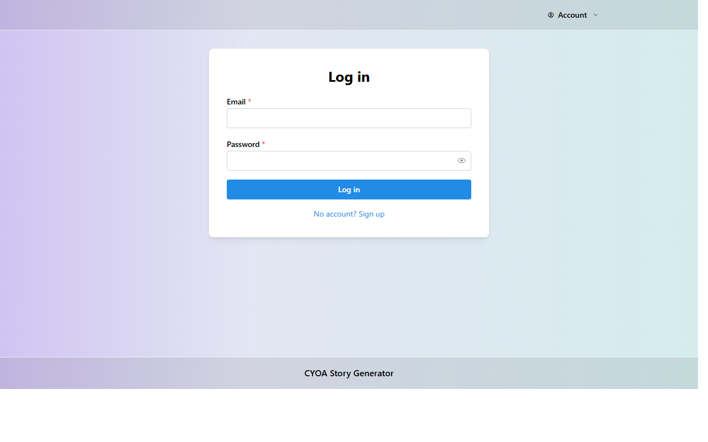

Email and password form, with a `No account? Sign up` link that routes to the signup page.

### Signup

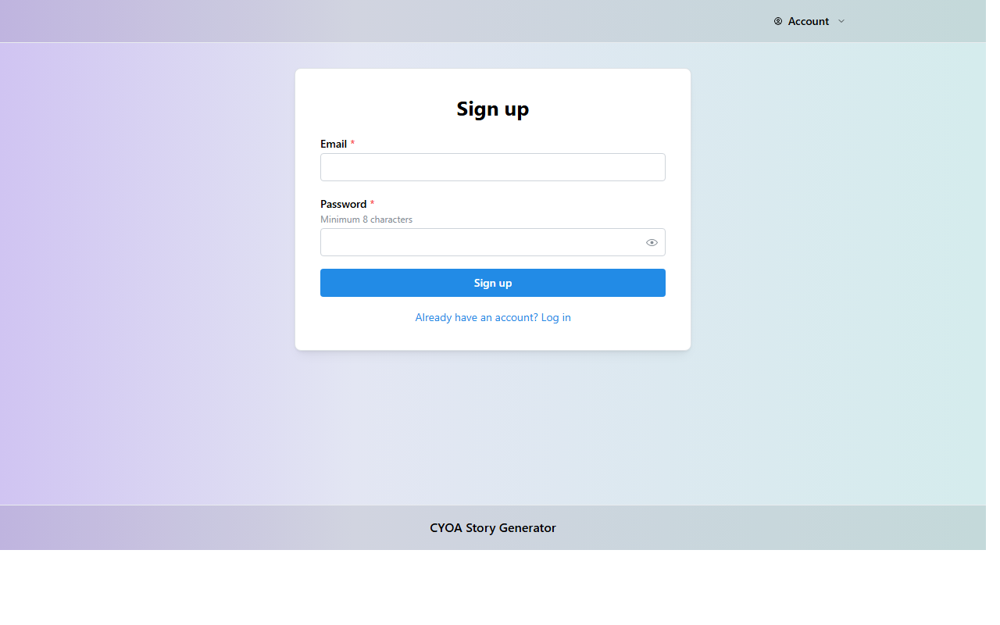

Email and password form (with a `Minimum 8 characters` hint), and an `Already have an account? Log in` link back to the login page.

### Dashboard

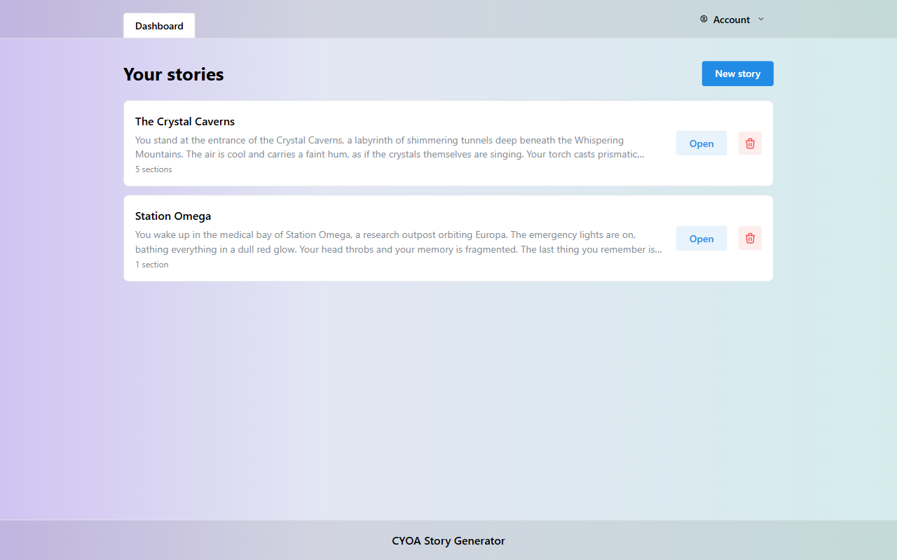

The signed-in user's library of stories. Each row shows a first-paragraph preview, a section count, and `Open` / delete actions. A `New story` button at the top kicks off the new-story setup flow.

### Setup (new story)

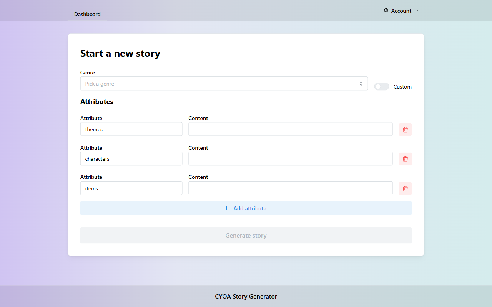

The new-story configuration page. Pick a genre (or toggle `Custom`), tweak the attribute table (themes, characters, items by default), and hit `Generate story` to kick off the first generation pass.

### Account

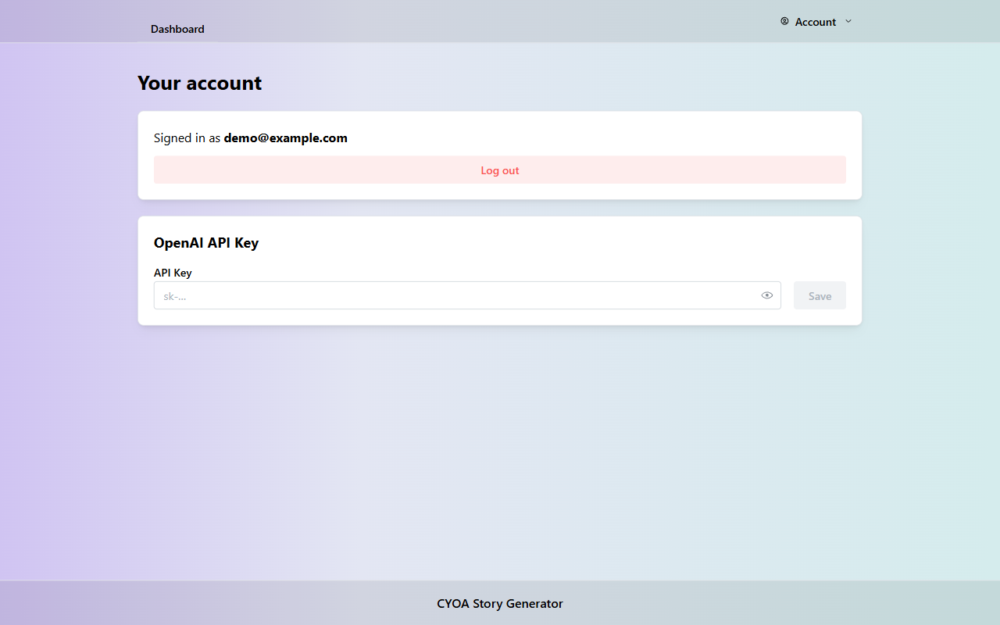

Shows the signed-in email, a `Log out` button, and an `OpenAI API key` form. Saved keys are encrypted before storage.

### Generator

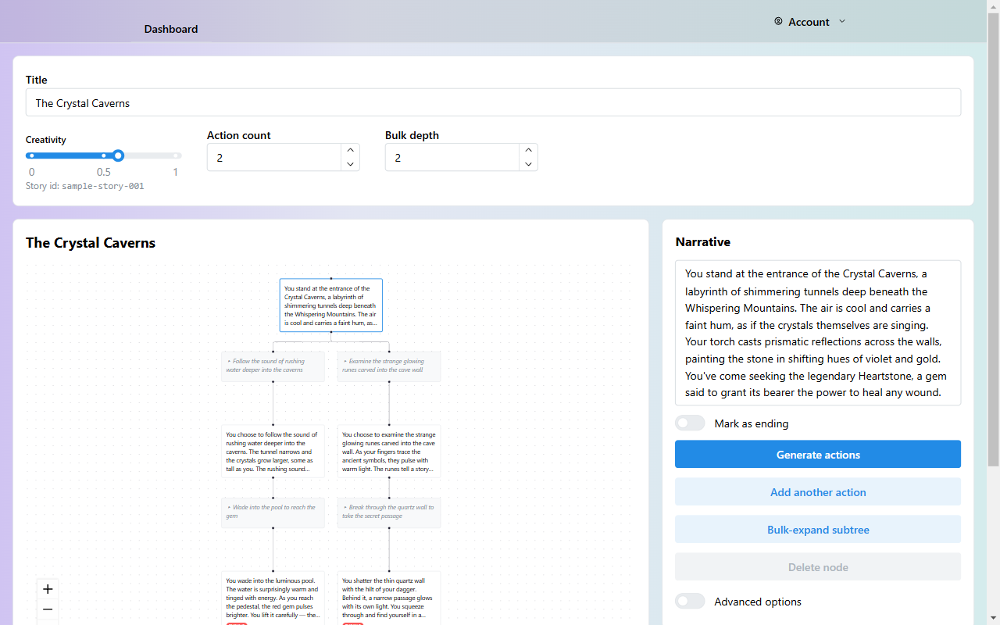

The interactive editor for an open story. The main canvas shows narrative and action nodes laid out as a graph; selecting a node opens an options panel on the right with the node's narrative text and actions: `Mark as ending`, `Generate actions`, `Add another action`, `Bulk-expand subtree`, `Delete node`. The top bar carries the story title plus three generation knobs — creativity, action count, and bulk-expand depth.

## 🎬 Earlier Captures (legacy)

> The GIFs below were captured against an earlier version of the UI. The flows still illustrate the major paths through the app; visual details have evolved (auth-aware routing, polished header, refreshed layouts).

### Authentication flow (legacy)

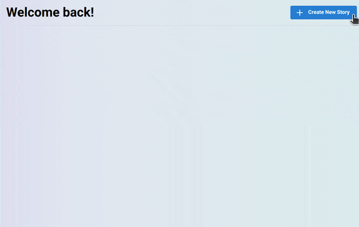

Welcome page transitioning into signup and login. Modern equivalents: [`welcome.png`](docs/screenshots/welcome.png), [`login.png`](docs/screenshots/login.png), [`signup.png`](docs/screenshots/signup.png).

### Dashboard (legacy)

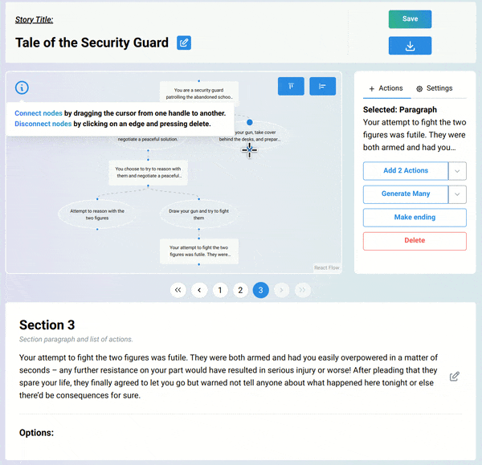

Story library walkthrough with delete confirmation. Modern equivalent: [`dashboard.png`](docs/screenshots/dashboard.png).

### Setup (legacy)

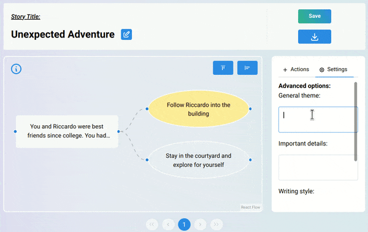

Genre and attributes form filling out before kicking off generation. Modern equivalent: [`setup.png`](docs/screenshots/setup.png).

### Generator (legacy)

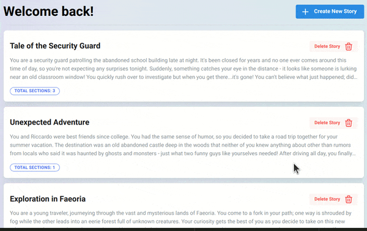

Graph editor with node expansion, save, and download. Modern equivalent: [`generator.png`](docs/screenshots/generator.png).

## 📂 Sub-Module Documentation

- [`README.md`](README.md) — root README with quick start, the demo account, and configuration.
- [`README.tech-stack.md`](README.tech-stack.md) — primer on every library and framework in the stack.
